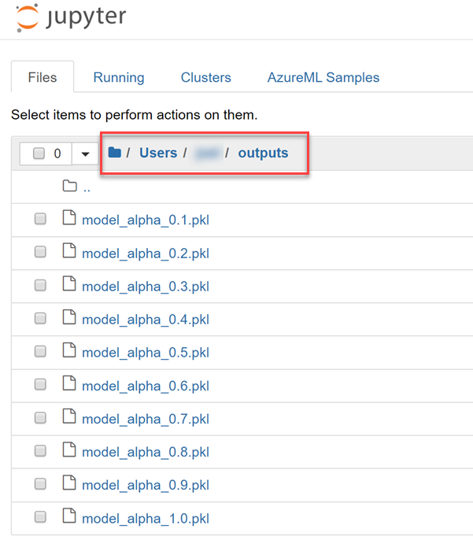
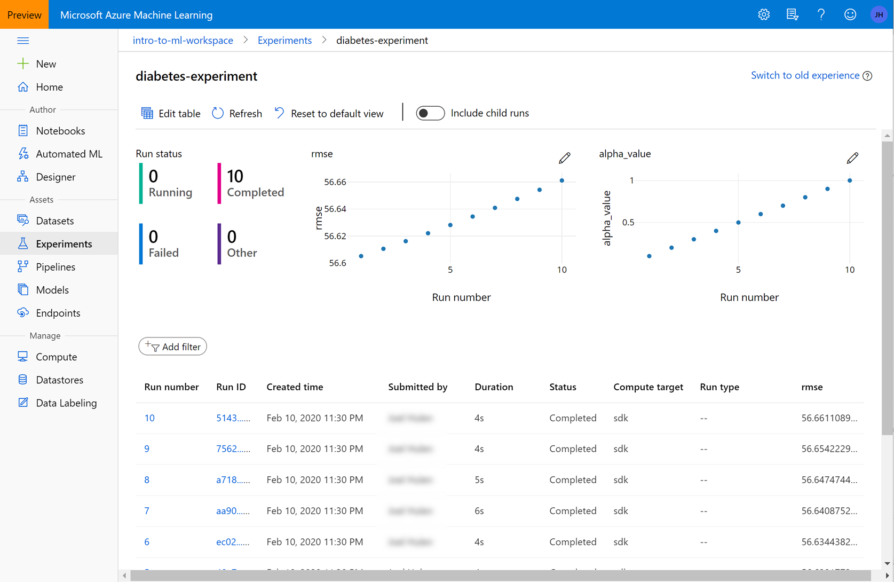

# Compute Resources

## Train a machine learning model from a managed notebook environment

So far, the Managed Services for Azure Machine Learning lesson has covered **compute instance** and the benefits it provides through its fully managed environment containing everythng you need to run Azure Machine Learnijng. Now it is time to gain some hands-on experience by putting a compute instance to work.

# Overview

In this lab, you learn the foundational design patterns in Azure Machine Learning, and train a simple scikit-learn model based on the diabetes data set. After completing this lab, you will have the practical knowledge of the SDK to scale up to developing more-complex experiments and workflows. 

In this tutorial, you learn the following tasks:

> * Connect your workspace and create an experiment 
> * Load data and train a scikit-learn model

## Exercise 1 Open Notebook for this Lab

1. Within Azure Machine Learning Studio, navigate to **Compute**, then select **Compute Instances**. For the Compute Instance that is available, under Application URI select `Jupyter`. Be sure to select `Jupyter` and not `JupterLab`.

   

2. Within the Jupyter environment, open the **Users** folder, then the folder that has your assigned username and then open `1st-experiment-sdk-train-model.ipynb`. This is the Python notebook you will step through executing in this lab.

   

3. Follow the instructions within the notebook to complete the lab.

4. After completing the notebook, navigate back to the **Users** folder, select your assigned username, then select the newly created **outputs** sub-folder. Here you will see the trained models (`*.pkl` files) generated by the last cell you executed.

    

5. Navigate back to Azure Machine Learning Studio, select **Experiments** in the left-hand menu, then select the **diabetes-experiment** submitted by the notebook.

    

6. Here you can view details about the experiment and each of its runs, which created a new version of the model.

    

# Next Steps

Congratulations! You have just learned how to use the Azure Machine Learning SDK to help you explain what influences the predictions a model makes. You can now return to the Udacity portal to continue with the lesson.

