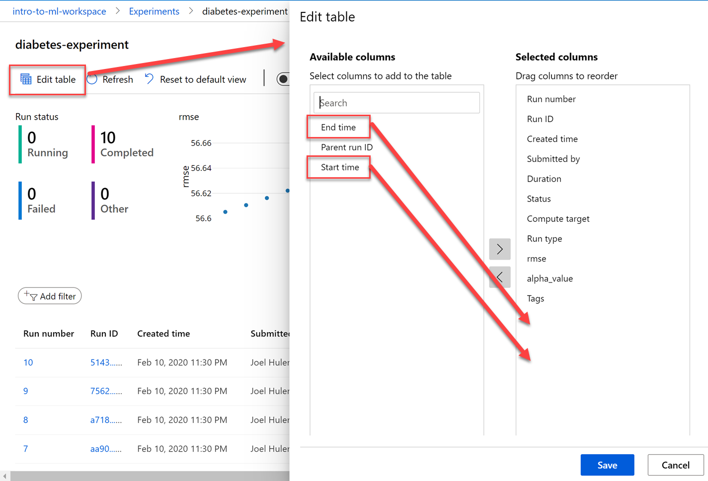
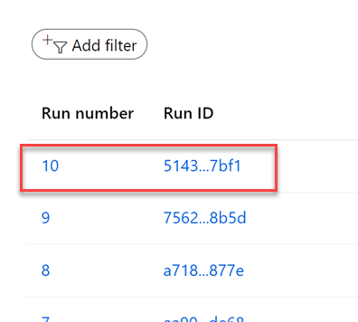
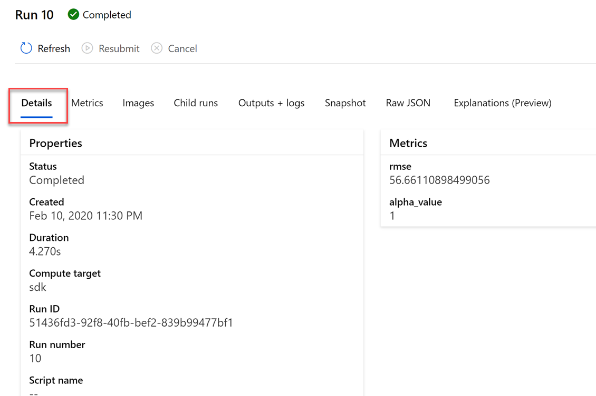

# Compute Resources

## Explore experiments and runs

In the previous lab (19), you executed a Jupyter notebook that trained a model through a series of 10 different runs, each with a different alpha hyperparameter applied. These runs were created within the experiment you created at the beginning of the notebook. Because of this, Azure Machine Learning logged the details so you can review the result of each run and see how the alpha value is different between the them.

# Overview

In this lab, you view the experiments and runs executed by the notebook in the previous lab. You navigate to the **Experiments** blade in Azure Machine Learning Studio. Here you see all the individual runs in the experiment. Any custom-logged values (alpha_value and rmse, in this case) become fields for each run, and also become available for the charts and tiles at the top of the experiment page. To add a logged metric to a chart or tile, hover over it, click the edit button, and find your custom-logged metric.

When training models at scale over hundreds and thousands of separate runs, this page makes it easy to see every model you trained, specifically how they were trained, and how your unique metrics have changed over time.

## Exercise 1: Open Experiments in the portal

1. Within Azure Machine Learning Studio, select **Experiments** in the left-hand menu, then select the **diabetes-experiment** submitted by the notebook you executed in the previous lab (19).

    

2. Here you can view details about the experiment and each of its runs, which created a new version of the model.

    

3. Select **Edit table** in the top toolbar. In the Edit table dialog that appears, add the **End time** and **Start time** columns to the Selected columns list, then select **Save**.

    

    Depending on your screen resolution, you might need to scroll down the table to see the bottom horizontal scrollbar. When you scroll all the way to the right, you will see the new columns you added.

    

4. Select either the **Run number** *or* the **Run ID** of one of the runs to view its details. Both links on a run display the same dialog.

    

5. The **Details** tab shows you more detailed information about each run, including the run time and metrics.

    

6. Select the **Outputs + logs** tab. You see the `.pkl` file for the model that was uploaded to the run during each training iteration. This lets you download the model file rather than having to retrain it manually.

    

# Next Steps

Congratulations! You have just learned how to use the Azure Machine Learning SDK to help you explain what influences the predictions a model makes. You can now return to the Udacity portal to continue with the lesson.

